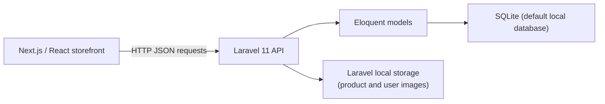

# 3Z Shop

An e-commerce storefront built with Next.js and a separate Laravel API. Shoppers can browse a product catalog, select product options, and manage a cart. The repository also contains buyer-account and administration interfaces.

The frontend and backend are separate repositories:

- [Frontend](https://github.com/Zakaria-ocd/ecom-project)
- [Backend API](https://github.com/Zakaria-ocd/gestion_ecom)

## Overview

The storefront loads catalog and category data from the Laravel API. Visitors can browse products and use a browser-persisted guest cart. Account registration and login use API-issued tokens; signed-in cart operations and order-related pages use the backend API.

The implementation includes buyer checkout and administration flows, but some are incomplete or inconsistent with the current backend schema and routes. See [Implementation status](#implementation-status) before treating them as end-to-end features.

## Features

- Browse products, categories, and product details.
- Filter and sort the product catalog by category, color, size, price, and rating.
- View product images and available configurable choices, including price and quantity.
- Register and sign in as a buyer; view and update profile information.
- Keep a guest cart in browser storage and use API-backed cart operations when signed in.
- Switch between light and dark appearance.

## Tech stack

| Area | Technologies |
| --- | --- |
| Frontend | Next.js 15 App Router, React 18, JavaScript/JSX |
| UI | Tailwind CSS, Radix UI primitives, Lucide React, React Icons |
| Frontend state | Redux Toolkit, React-Redux, React hooks and browser storage |
| Backend | PHP 8.2+, Laravel 11, Laravel Sanctum, Eloquent ORM |
| Database | SQLite by default for local backend configuration |

## Architecture

The browser application makes JSON requests to the Laravel API. Laravel controllers use Eloquent models to read and write the configured database. The backend also stores uploaded product and user images on Laravel's configured local storage disk and serves them through API routes.



The frontend currently targets `http://localhost:8000`; its development server uses `http://localhost:3000`.

## Main data flow

1. The storefront requests products, categories, product choices, and images from the API.
2. A guest cart is saved in browser storage. Signed-in cart requests use the authenticated cart endpoints; the frontend also attempts to merge a guest cart after login.
3. Buyer registration and login return a Sanctum token. The frontend stores that token in `localStorage` and sends it as a bearer token on protected API requests.
4. The checkout interface submits a cash-on-delivery order request. The backend order controller is intended to create an order and its items from the cart, then clear the cart. This path is **not verified end to end** because the active model/controller column names differ from the order migrations.

## API

The routes below are declared in the backend and used by the frontend. The API base URL for local development is `http://localhost:8000`.

| Method and path | Use |
| --- | --- |
| `POST /api/register`, `POST /api/login` | Create a buyer account or sign in |
| `GET /api/user`, `POST /api/logout` | Read the signed-in buyer or revoke the current token; requires authentication |
| `GET /api/showProducts`, `GET /api/filter-products` | Load and filter the storefront catalog |
| `GET /api/products/{id}`, `GET /api/products/{id}/choices` | Load product details and configurable choices |
| `GET /api/categories`, `GET /api/categories/{id}`, `GET /api/categories/{id}/products` | Browse categories and their products |
| `GET /api/cart`, `POST /api/cart/add`, `PUT /api/cart/update`, `DELETE /api/cart/remove`, `POST /api/cart/merge` | Read and update a signed-in cart; requires authentication |
| `POST /api/orders`, `GET /api/orders/{limit}/limit`, `GET /api/orders/{id}` | Create and view orders; requires authentication, with the schema caveat above |

Successful authentication responses include a `user` object and a token. Protected requests send that token using HTTP bearer authentication. Cart responses expose cart contents under `cart_items`; catalog and category responses have endpoint-specific shapes.

## Project structure

```text
3z-shop-frontend/
  src/
    app/                 Next.js routes for storefront, account, and admin pages
    components/          Shared UI plus user and admin components
    features/            Redux slices
    hooks/               Authentication, cart, and checkout hooks
    lib/                 API, authentication, cart, and order helpers
  public/assets/         Logo and product/UI image assets
  package.json

3z-shop-backend/
  app/Http/Controllers/  API controllers
  app/Http/Middleware/   Role middleware
  app/Models/            Eloquent models and relationships
  database/migrations/   Database schema migrations
  database/seeders/      Development user seeder
  routes/api.php         API route declarations
```

## Getting started

### Prerequisites

- Node.js 18 (the frontend `.nvmrc` specifies `18`) and npm.
- PHP 8.2 or newer and Composer.
- PHP SQLite/PDO SQLite support for the default local database.

From a parent directory, clone both repositories into sibling folders:

```powershell
git clone https://github.com/Zakaria-ocd/ecom-project.git 3z-shop-frontend
git clone https://github.com/Zakaria-ocd/gestion_ecom.git 3z-shop-backend
```

### 1. Configure and start the backend

In PowerShell:

```powershell
Set-Location .\3z-shop-backend
composer install
Copy-Item .env.example .env
if (-not (Test-Path .\database\database.sqlite)) {
  New-Item -ItemType File -Path .\database\database.sqlite | Out-Null
}
php artisan key:generate
```

In `.env`, keep `DB_CONNECTION=sqlite` for the default local setup and set:

```dotenv
APP_URL=http://localhost:8000
```

Then migrate and start the API:

```powershell
php artisan migrate
php artisan serve --host=127.0.0.1 --port=8000
```

To create the development users in the seeder, run `php artisan db:seed`. The seeder does not create product or category catalog data.

### 2. Configure and start the frontend

In a second terminal:

```powershell
Set-Location .\3z-shop-frontend
npm ci
npm run dev
```

Open `http://localhost:3000`. The frontend expects the API at `http://localhost:8000`, and the backend CORS configuration allows the default frontend origin `http://localhost:3000`.

The frontend declares `NEXT_PUBLIC_API_URL` with a default of `http://localhost:8000`. At present, that setting is used by the authentication helper only; most other API calls contain a hard-coded `http://localhost:8000` URL. Changing this variable alone does not configure all frontend requests for another environment.

## Environment variables

| Project | Variable | Purpose |
| --- | --- | --- |
| Frontend | `NEXT_PUBLIC_API_URL` | API base URL used by the authentication helper; defaults to `http://localhost:8000` |
| Backend | `APP_KEY` | Laravel encryption key; generate it with `php artisan key:generate` |
| Backend | `APP_URL` | Backend application URL; use `http://localhost:8000` locally |
| Backend | `DB_CONNECTION` | Database driver; `.env.example` defaults to `sqlite` |
| Backend | `DB_DATABASE` | Optional database path; when unset with SQLite, Laravel uses `database/database.sqlite` |

The backend `.env.example` also contains Laravel defaults for sessions, cache, queues, mail, and optional database drivers. Do not commit local `.env` files or secrets.

## Implementation status

- **Checkout and order persistence:** The UI and API code implement a cash-on-delivery order flow. The `Order` model/controller use `status` and `total_price`, while the migrations create differently named order columns (`delivery_status`, `payment_status`, and `total_amount`). Treat checkout and order persistence as partial until these are reconciled and tested against a freshly migrated database.
- **First authenticated cart creation:** Cart CRUD and merge routes exist, but the backend cart controller assigns a `cart_id` attribute to the user even though the inspected user model/schema uses the cart's `user_id` relationship. Verify a first-time signed-in cart before relying on that path.
- **Administration:** Admin pages and API handlers are present, but not every frontend request matches a declared backend route. The administration area is therefore not described here as a complete workflow.
- **Other visible routes:** The wishlist page is placeholder content, `/products` redirects to `/`, and the login page links to a forgot-password path that is not implemented.
- **State implementations:** A Redux cart slice is configured alongside the storefront's hook-based cart service. The slice uses different cart URLs/response assumptions from the backend routes and should not be assumed to represent the hook-based flow.

## Preview

**Live demo:** No current deployment URL could be verified from the checked-in configuration or documentation.

No screenshots or recorded previews are included in the repository yet. Add screenshots, a GIF, or a video here when available.
